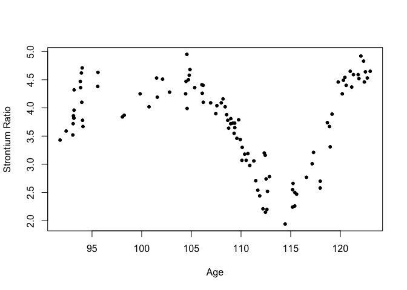
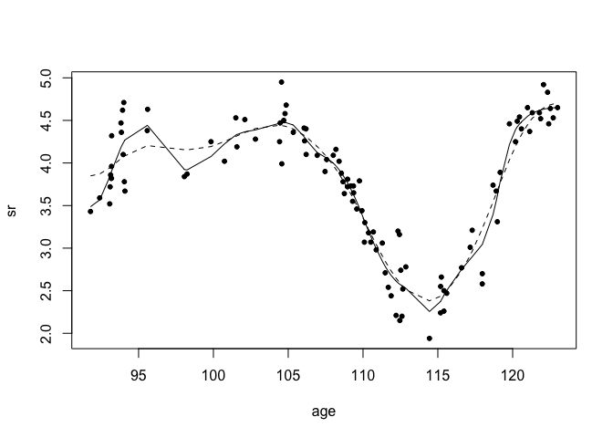

Confidence bands for smoothness with Gaussian process regression using
INLA
================
[Julian Faraway](https://julianfaraway.github.io/)
21 September 2020

See the [introduction](index.md) for more about INLA. See an example of
[Gaussian process regression](gpreg.html) using the same data. The
construction is detailed in our
[book](http://julianfaraway.github.io/brinla/).

Load the packages (you may need to [install the brinla
package](https://github.com/julianfaraway/brinla))

``` r
library(INLA)
library(brinla)
```

# Data

We use the fossil example from (Bralower et al. 1997) and used by
(Chaudhuri and Marron 1999). We have the ratio of strontium isotopes
found in fossil shells in the mid-Cretaceous period from about 90 to 125
million years ago. We rescale the response as in the SiZer paper.

``` r
data(fossil, package="brinla")
fossil$sr <- (fossil$sr-0.7)*100
```

Plot the data:

``` r
plot(sr ~ age, fossil, xlab="Age",ylab="Strontium Ratio")
```

<!-- -->

# GP fitting

The default fit uses priors based on the SD of the response and the
range of the predictor to motivate sensible priors.

``` r
gpmod = bri.gpr(fossil$age, fossil$sr)
```

We can plot the resulting fit and 95% credible bands

``` r
plot(sr ~ age, fossil, xlab="Age",ylab="Strontium Ratio")
lines(gpmod$xout, gpmod$mean)
lines(gpmod$xout, gpmod$lcb, lty=2)
lines(gpmod$xout, gpmod$ucb, lty=2)
```

<!-- -->

What do these bands represent? At any given value of the predictor (in
this case, the age), we have a posterior distribution for the strontium
ratio. The credible interval at this value of age is computed from the
the 2.5% and 97.5% percentiles of this distribution. It expresses the
uncertainty about the response at this predictor value.

# Confidence bands for smoothness

The bands are constructed from joining all the pointwise intervals. This
gives us a sense of the uncertainty of the response curve. But the value
of these bands is limited. We might wish to say that curves falling
within these bands have high probability while those that venture
outside have lower probability. But this would not be entirely true. The
bands tells us little about how rough or smooth the curve is likely to
be. A rough sawtooth function could fit between the bands but is it
plausible?.

In (Chaudhuri and Marron 1999), the question of whether there really is
a dip (local minimum) in the response around 98 million years ago is
asked. Notice that we could easily draw a function between the upper and
lower bands that has no dip in this region. In contrast, we are sure
there is a dip at 115 million years as the bands are tight enough to be
clear about this. So do we conclude there is no strong evidence of a dip
at 98?

The presence of a dip at 98 is strongly determined by how much we smooth
the function. Gaussian process regression controls this primarily
through the range parameter. The curves shown on the figure derive from
the maximum posterior value of this parameter. Yet there is considerable
uncertainty in this parameter which has its own posterior distribution.
We take the 2.5% and 97.5% percentiles of this range posterior and then
plot the resulting function with the other parameters set at their
maximum posterior values. The resulting two curves are shown in the
following figure:

``` r
fg <- bri.smoothband(fossil$age, fossil$sr)  
plot(sr ~ age, fossil)
lines(fg$xout, fg$rcb,lty=1)
lines(fg$xout, fg$scb,lty=2)
```

<!-- -->

The solid line is lower band for the range parameter representing the
rougher end of the fit. The dashed line is the upper band for the range
parameter representing the smoother end of the fit. Both curves show a
dip at 98 (although the dip is very shallow for the smoother curve).
Thus we conclude there is a good evidence of a dip at 98. We can also
see that the amount of smoothing has very little impact on the shape of
the curve for the right end of the curve. In contrast, it makes a big
difference on the left end of the curve.

I argue that these bands are often more useful in expressing the
uncertainty in a fit than the usual bands. We are often more interested
in the shape of the fitted curve than its specific horizontal level.
Here is some more discussion about the [deficiencies of standard
confidence
bands](https://wordpress.com/post/farawaystatistics.wordpress.com/132)
and [confidence bands for
smoothness](https://wordpress.com/post/farawaystatistics.wordpress.com/159).
I have also have a paper, (Faraway 2016) on the topic.

# Package versions

``` r
sessionInfo()
```

    R version 4.0.2 (2020-06-22)
    Platform: x86_64-apple-darwin17.0 (64-bit)
    Running under: macOS Catalina 10.15.6
    
    Matrix products: default
    BLAS:   /Library/Frameworks/R.framework/Versions/4.0/Resources/lib/libRblas.dylib
    LAPACK: /Library/Frameworks/R.framework/Versions/4.0/Resources/lib/libRlapack.dylib
    
    locale:
    [1] en_GB.UTF-8/en_GB.UTF-8/en_GB.UTF-8/C/en_GB.UTF-8/en_GB.UTF-8
    
    attached base packages:
    [1] parallel  stats     graphics  grDevices utils     datasets  methods   base     
    
    other attached packages:
    [1] brinla_0.1.0  INLA_20.03.17 foreach_1.5.0 sp_1.4-2      Matrix_1.2-18 knitr_1.29   
    
    loaded via a namespace (and not attached):
     [1] codetools_0.2-16     lattice_0.20-41      digest_0.6.25        grid_4.0.2           MatrixModels_0.4-1  
     [6] magrittr_1.5         evaluate_0.14        rlang_0.4.7          stringi_1.4.6        rmarkdown_2.3       
    [11] splines_4.0.2        iterators_1.0.12     tools_4.0.2          stringr_1.4.0        Deriv_4.0.1         
    [16] xfun_0.16            yaml_2.2.1           compiler_4.0.2       htmltools_0.5.0.9000

# References

<div id="refs" class="references">

<div id="ref-bral:gsa:97">

Bralower, T. J., P. D. Fullagar, C. K. Paull, G. S. Dwyer, and R. M.
Leckie. 1997. “Mid-Cretaceous Strontium-Isotope Stratigraphy of Deep-Sea
Sections.” *Geological Society of America Bulletin* 109: 1421–42.

</div>

<div id="ref-chaud:jasa:99">

Chaudhuri, Probal, and J. S. Marron. 1999. “SiZer for Exploration of
Structures in Curves.” *Journal of the American Statistical Association*
94 (447): 807–23.

</div>

<div id="ref-STA4:STA4100">

Faraway, Julian. 2016. “Confidence Bands for Smoothness in Nonparametric
Regression.” *Stat* 5 (1): 4–10. <http://dx.doi.org/10.1002/sta4.100>.

</div>

</div>
