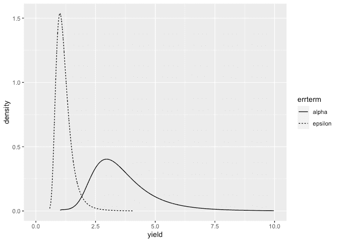
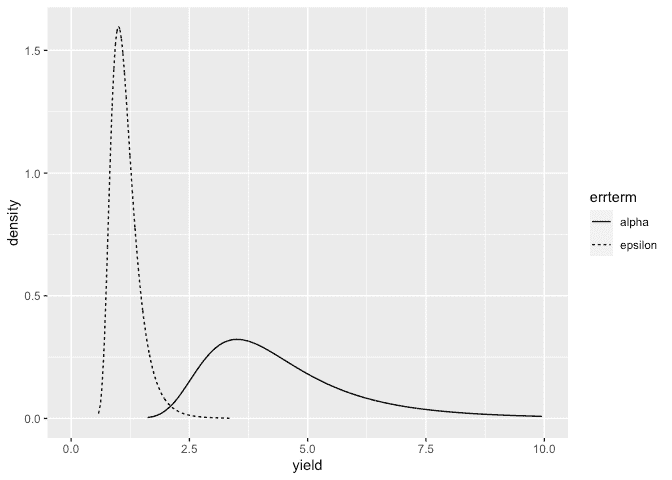

INLA Split Plot Model example
================
[Julian Faraway](https://julianfaraway.github.io/)
22 September 2020

See the [introduction](index.md) for an overview. Load the libraries:

``` r
library(ggplot2)
library(INLA)
```

# Data

Load in and plot the data:

``` r
data(irrigation, package="faraway")
summary(irrigation)
```

``` 
     field   irrigation variety     yield     
 f1     :2   i1:4       v1:8    Min.   :34.8  
 f2     :2   i2:4       v2:8    1st Qu.:37.6  
 f3     :2   i3:4               Median :40.1  
 f4     :2   i4:4               Mean   :40.2  
 f5     :2                      3rd Qu.:42.7  
 f6     :2                      Max.   :47.6  
 (Other):4                                    
```

``` r
ggplot(irrigation, aes(y=yield, x=field, shape=variety, color=irrigation)) + geom_point()
```

<!-- -->

# Default INLA fit

``` r
formula <- yield ~ irrigation + variety +f(field, model="iid")
result <- inla(formula, family="gaussian", data=irrigation)
result <- inla.hyperpar(result)
summary(result)
```

``` 

Call:
   "inla(formula = formula, family = \"gaussian\", data = irrigation)" 
Time used:
    Pre = 1.34, Running = 0.141, Post = 0.0792, Total = 1.56 
Fixed effects:
               mean    sd 0.025quant 0.5quant 0.975quant   mode kld
(Intercept)  38.469 2.810     32.829   38.461     44.151 38.452   0
irrigationi2  0.949 3.949     -7.047    0.957      8.876  0.969   0
irrigationi3  0.552 3.949     -7.442    0.560      8.481  0.571   0
irrigationi4  4.024 3.949     -3.986    4.037     11.939  4.054   0
varietyv2     0.750 0.618     -0.491    0.750      1.989  0.750   0

Random effects:
  Name    Model
    field IID model

Model hyperparameters:
                                         mean    sd 0.025quant 0.5quant 0.975quant  mode
Precision for the Gaussian observations 0.867 0.428      0.224    0.802      1.875 0.672
Precision for field                     0.105 0.076      0.020    0.088      0.288 0.061

Expected number of effective parameters(stdev): 8.71(0.29)
Number of equivalent replicates : 1.84 

Marginal log-Likelihood:  -66.93 
```

Default looks more plausible than [one way](oneway.html) and
[RBD](rbd.html) examples.

Compute the transforms to an SD scale for the field and error. Make a
table of summary statistics for the posteriors:

``` r
sigmaalpha <- inla.tmarginal(function(x) 1/sqrt(exp(x)),result$internal.marginals.hyperpar[[2]])
sigmaepsilon <- inla.tmarginal(function(x) 1/sqrt(exp(x)),result$internal.marginals.hyperpar[[1]])
restab=sapply(result$marginals.fixed, function(x) inla.zmarginal(x,silent=TRUE))
restab=cbind(restab, inla.zmarginal(sigmaalpha,silent=TRUE))
restab=cbind(restab, inla.zmarginal(sigmaepsilon,silent=TRUE))
colnames(restab) = c("mu","ir2","ir3","ir4","v2","alpha","epsilon")
data.frame(restab)
```

``` 
               mu     ir2     ir3     ir4       v2  alpha epsilon
mean       38.469 0.94858 0.55178  4.0238  0.74971 3.6514   1.191
sd         2.8106  3.9501  3.9501  3.9503  0.61835 1.3537  0.3602
quant0.025 32.823 -7.0565 -7.4515 -3.9959 -0.49254 1.8567 0.73092
quant0.25  36.772 -1.4166 -1.8137  1.6614  0.36647 2.7362 0.94892
quant0.5   38.447 0.93806 0.54067  4.0178  0.74668 3.3724  1.1156
quant0.75  40.129  3.2859  2.8887   6.364   1.1269 4.2396  1.3409
quant0.975 44.136  8.8579  8.4629  11.919   1.9856 7.0837  2.1047
```

Also construct a plot the SD posteriors:

``` r
ddf <- data.frame(rbind(sigmaalpha,sigmaepsilon),errterm=gl(2,nrow(sigmaalpha),labels = c("alpha","epsilon")))
ggplot(ddf, aes(x,y, linetype=errterm))+geom_line()+xlab("yield")+ylab("density")+xlim(0,10)
```

<!-- -->

Posteriors look OK.

# Informative Gamma priors on the precisions

Now try more informative gamma priors for the precisions. Define it so
the mean value of gamma prior is set to the inverse of the variance of
the residuals of the fixed-effects only model. We expect the two error
variances to be lower than this variance so this is an overestimate. The
variance of the gamma prior (for the precision) is controlled by the
`apar` shape parameter.

``` r
apar <- 0.5
lmod <- lm(yield ~ irrigation+variety, data=irrigation)
bpar <- apar*var(residuals(lmod))
lgprior <- list(prec = list(prior="loggamma", param = c(apar,bpar)))
formula = yield ~ irrigation+variety+f(field, model="iid", hyper = lgprior)
result <- inla(formula, family="gaussian", data=irrigation)
result <- inla.hyperpar(result)
summary(result)
```

``` 

Call:
   "inla(formula = formula, family = \"gaussian\", data = irrigation)" 
Time used:
    Pre = 1.32, Running = 0.153, Post = 0.0842, Total = 1.56 
Fixed effects:
               mean    sd 0.025quant 0.5quant 0.975quant   mode kld
(Intercept)  38.491 3.440     31.569   38.477     45.489 38.462   0
irrigationi2  0.924 4.844     -8.936    0.939     10.674  0.958   0
irrigationi3  0.529 4.844     -9.328    0.542     10.281  0.560   0
irrigationi4  3.986 4.845     -5.899    4.009     13.713  4.037   0
varietyv2     0.750 0.605     -0.463    0.750      1.961  0.750   0

Random effects:
  Name    Model
    field IID model

Model hyperparameters:
                                         mean    sd 0.025quant 0.5quant 0.975quant  mode
Precision for the Gaussian observations 0.892 0.425      0.260    0.826      1.896 0.692
Precision for field                     0.070 0.047      0.012    0.059      0.188 0.039

Expected number of effective parameters(stdev): 8.80(0.193)
Number of equivalent replicates : 1.82 

Marginal log-Likelihood:  -55.86 
```

Compute the summaries as before:

``` r
sigmaalpha <- inla.tmarginal(function(x) 1/sqrt(exp(x)),result$internal.marginals.hyperpar[[2]])
sigmaepsilon <- inla.tmarginal(function(x) 1/sqrt(exp(x)),result$internal.marginals.hyperpar[[1]])
restab=sapply(result$marginals.fixed, function(x) inla.zmarginal(x,silent=TRUE))
restab=cbind(restab, inla.zmarginal(sigmaalpha,silent=TRUE))
restab=cbind(restab, inla.zmarginal(sigmaepsilon,silent=TRUE))
colnames(restab) = c("mu","ir2","ir3","ir4","v2","alpha","epsilon")
data.frame(restab)
```

``` 
               mu     ir2     ir3     ir4       v2  alpha epsilon
mean       38.491 0.92369 0.52856  3.9859  0.74973 4.5237  1.1611
sd         3.4413  4.8459  4.8459  4.8464  0.60482 1.8183 0.31715
quant0.025 31.561 -8.9479 -9.3396 -5.9123 -0.46439 2.3073 0.72703
quant0.25  36.456 -1.9131 -2.3089   1.154   0.3723 3.3008 0.93973
quant0.5    38.46 0.91484 0.51868  3.9851  0.74676 4.1029  1.0997
quant0.75  40.474  3.7313  3.3355  6.7988   1.1212 5.2456  1.3111
quant0.975 45.469   10.65  10.258  13.688   1.9576 9.2349  1.9532
```

Make the plots:

``` r
ddf <- data.frame(rbind(sigmaalpha,sigmaepsilon),errterm=gl(2,nrow(sigmaalpha),labels = c("alpha","epsilon")))
ggplot(ddf, aes(x,y, linetype=errterm))+geom_line()+xlab("yield")+ylab("density")+xlim(0,10)
```

<!-- -->

Posteriors look OK.

# Penalized Complexity Prior

In [Simpson et al (2015)](http://arxiv.org/abs/1403.4630v3), penalized
complexity priors are proposed. This requires that we specify a scaling
for the SDs of the random effects. We use the SD of the residuals of the
fixed effects only model (what might be called the base model in the
paper) to provide this scaling.

``` r
lmod <- lm(yield ~ irrigation+variety, irrigation)
sdres <- sd(residuals(lmod))
pcprior <- list(prec = list(prior="pc.prec", param = c(3*sdres,0.01)))
formula <- yield ~ irrigation+variety+f(field, model="iid", hyper = pcprior)
result <- inla(formula, family="gaussian", data=irrigation)
result <- inla.hyperpar(result)
summary(result)
```

``` 

Call:
   "inla(formula = formula, family = \"gaussian\", data = irrigation)" 
Time used:
    Pre = 1.32, Running = 0.145, Post = 0.0828, Total = 1.55 
Fixed effects:
               mean    sd 0.025quant 0.5quant 0.975quant   mode kld
(Intercept)  38.477 3.042     32.361   38.469     44.639 38.457   0
irrigationi2  0.940 4.280     -7.731    0.949      9.549  0.962   0
irrigationi3  0.544 4.280     -8.125    0.552      9.154  0.565   0
irrigationi4  4.011 4.281     -4.674    4.025     12.604  4.045   0
varietyv2     0.750 0.606     -0.467    0.750      1.964  0.750   0

Random effects:
  Name    Model
    field IID model

Model hyperparameters:
                                         mean    sd 0.025quant 0.5quant 0.975quant  mode
Precision for the Gaussian observations 0.886 0.425      0.253     0.82      1.891 0.686
Precision for field                     0.082 0.053      0.018     0.07      0.214 0.049

Expected number of effective parameters(stdev): 8.77(0.215)
Number of equivalent replicates : 1.82 

Marginal log-Likelihood:  -56.40 
```

Compute the summaries as before:

``` r
sigmaalpha <- inla.tmarginal(function(x) 1/sqrt(exp(x)),result$internal.marginals.hyperpar[[2]])
sigmaepsilon <- inla.tmarginal(function(x) 1/sqrt(exp(x)),result$internal.marginals.hyperpar[[1]])
restab=sapply(result$marginals.fixed, function(x) inla.zmarginal(x,silent=TRUE))
restab=cbind(restab, inla.zmarginal(sigmaalpha,silent=TRUE))
restab=cbind(restab, inla.zmarginal(sigmaepsilon,silent=TRUE))
colnames(restab) = c("mu","ir2","ir3","ir4","v2","alpha","epsilon")
data.frame(restab)
```

``` 
               mu     ir2     ir3     ir4       v2  alpha epsilon
mean       38.477 0.93976 0.54353  4.0106  0.74972 4.0372  1.1676
sd         3.0424  4.2806  4.2806  4.2808  0.60614 1.3393 0.32498
quant0.025 32.355 -7.7417 -8.1361 -4.6858 -0.46761 2.1601 0.72807
quant0.25  36.614 -1.6624  -2.059  1.4111  0.37106 3.0892 0.94212
quant0.5   38.454 0.92811 0.53126  4.0037  0.74674 3.7841  1.1037
quant0.75    40.3  3.5109  3.1143  6.5847   1.1224 4.7019  1.3181
quant0.975 44.617  9.5218  9.1274  12.579   1.9608 7.3651  1.9816
```

Make the plots:

``` r
ddf <- data.frame(rbind(sigmaalpha,sigmaepsilon),errterm=gl(2,nrow(sigmaalpha),labels = c("alpha","epsilon")))
ggplot(ddf, aes(x,y, linetype=errterm))+geom_line()+xlab("yield")+ylab("density")+xlim(0,10)
```

<!-- -->

Posteriors look OK.

# Package version info

``` r
sessionInfo()
```

``` 
R version 4.0.2 (2020-06-22)
Platform: x86_64-apple-darwin17.0 (64-bit)
Running under: macOS Catalina 10.15.6

Matrix products: default
BLAS:   /Library/Frameworks/R.framework/Versions/4.0/Resources/lib/libRblas.dylib
LAPACK: /Library/Frameworks/R.framework/Versions/4.0/Resources/lib/libRlapack.dylib

locale:
[1] en_GB.UTF-8/en_GB.UTF-8/en_GB.UTF-8/C/en_GB.UTF-8/en_GB.UTF-8

attached base packages:
[1] parallel  stats     graphics  grDevices utils     datasets  methods   base     

other attached packages:
[1] INLA_20.03.17 foreach_1.5.0 sp_1.4-2      Matrix_1.2-18 ggplot2_3.3.2 knitr_1.29   

loaded via a namespace (and not attached):
 [1] pillar_1.4.6         compiler_4.0.2       iterators_1.0.12     tools_4.0.2          digest_0.6.25       
 [6] evaluate_0.14        lifecycle_0.2.0      tibble_3.0.3         gtable_0.3.0         lattice_0.20-41     
[11] pkgconfig_2.0.3      rlang_0.4.7          yaml_2.2.1           xfun_0.16            withr_2.2.0         
[16] dplyr_1.0.2          stringr_1.4.0        MatrixModels_0.4-1   generics_0.0.2       vctrs_0.3.4         
[21] grid_4.0.2           tidyselect_1.1.0     glue_1.4.2           R6_2.4.1             rmarkdown_2.3       
[26] farver_2.0.3         purrr_0.3.4          magrittr_1.5         splines_4.0.2        scales_1.1.1        
[31] codetools_0.2-16     ellipsis_0.3.1       htmltools_0.5.0.9000 colorspace_1.4-1     Deriv_4.0.1         
[36] labeling_0.3         stringi_1.4.6        munsell_0.5.0        crayon_1.3.4        
```
